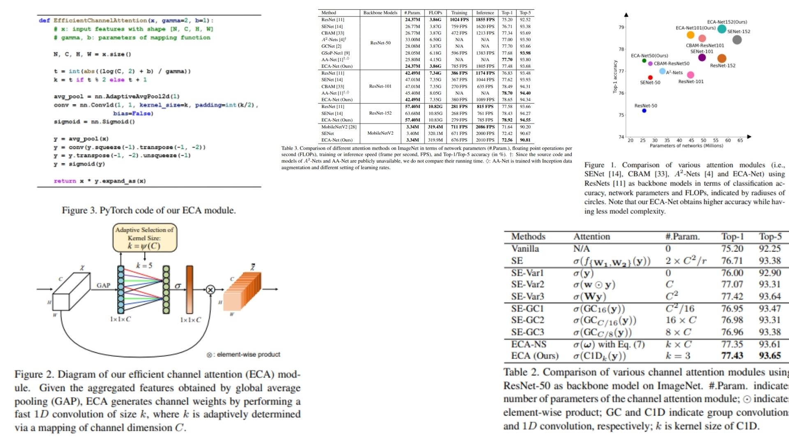

# 🌱 ECA-Net-Replication – Efficient Channel Attention for CNNs

This repository provides a **PyTorch-based replication** of  
**ECA-Net: Efficient Channel Attention for Deep Convolutional Neural Networks**.

The focus is **understanding and implementing ECA attention mechanisms** practically,  
rather than chasing benchmark SOTA results.

- Refines feature maps with **efficient channel attention** ⚡  
- Emphasizes **which channels are important** in CNN features ✨  
- Extremely **lightweight & plug-and-play** for any CNN backbone 🛠️  

**Paper reference:** [ECA-Net – Wang et al., 2020](https://arxiv.org/abs/1910.03151) 📄

---

## 🌌 Overview – ECA Pipeline



The core idea:

> Efficiently learn **channel-wise attention** by capturing local cross-channel interactions using a fast 1D convolution, without dimensionality reduction.  

High-level procedure:

1. Extract feature maps $X \in \mathbb{R}^{C \times H \times W}$ from a CNN backbone.  
2. Apply **Global Average Pooling (GAP)** per channel → $y = g(X)$.  
3. Perform **local cross-channel interaction** using 1D convolution of adaptive kernel size $k$:  
   $$\omega = \sigma(\text{C1D}_k(y))$$  
   where $\sigma$ is the sigmoid function.  
4. Multiply attention weights $\omega$ with input features to get **refined features**.  
5. Forward refined features through the remaining network.  

The module can be inserted **per convolution block** and is fully **end-to-end trainable**.

---

## 🧮 Attention Computation – Math Essentials

### Channel Attention (ECA)
Given $y = g(X) \in \mathbb{R}^{C}$ (after GAP), ECA computes channel attention via **local interaction**:

$$
\omega_i = \sigma\Big(\sum_{j \in \Omega_i^k} w_j y_j\Big), \quad i=1,...,C
$$

Where:  
- $\Omega_i^k$ = set of $k$ neighboring channels for channel $i$  
- $w_j$ = shared learnable parameter for 1D convolution  
- $k$ = kernel size, adaptively determined based on channel dimension $C$  

### Adaptive Kernel Size
To avoid manual tuning of $k$, it is determined by a non-linear mapping:

$$
k = \psi(C) = \big|\frac{\log_2(C)}{\gamma} + \frac{b}{\gamma}\big|_\text{odd}
$$

Where:  
- $\gamma$ and $b$ are hyperparameters (e.g., $\gamma=2, b=1$)  
- $|\cdot|_\text{odd}$ rounds to the nearest odd integer  

This ensures **high-dimensional channels** interact with more neighbors while low-dimensional channels use shorter ranges.

### Feature Refinement
The final refined feature map:

$$
X' = \omega \otimes X
$$

Where $\otimes$ denotes element-wise multiplication along the channel dimension.

---

## 🧠 What the Module Does

- Captures **local cross-channel dependencies** efficiently  
- Avoids dimensionality reduction → direct channel-weight correspondence  
- Extremely lightweight: few extra parameters and negligible GFLOPs  
- Plug-and-play in any CNN block (ResNet, MobileNetV2, etc.)  

---

## 📦 Repository Structure

```bash
ECA-Net-Replication/
├── src/
│   ├── layers/
│   │   ├── conv_layer.py          # Standard Conv2d wrapper
│   │   ├── activation.py          # sigmoid helper
│   │   └── normalization.py       # BatchNorm for backbone
│   │
│   ├── attention/
│   │   └── eca_layer.py           # GAP + 1D Conv + Sigmoid
│   │
│   ├── backbone/
│   │   └── resnet_blocks.py       # CNN block + optional ECA integration
│   │
│   ├── model/
│   │   └── eca_cnn.py             # CNN + ECA forward logic
│   │
│   └── config.py                  # gamma, b, backbone type
│
├── images/
│   └── figmix.jpg                  # ECA overview figure
│
├── requirements.txt
└── README.md
```
---


## 🔗 Feedback

For questions or feedback, contact: [barkin.adiguzel@gmail.com](mailto:barkin.adiguzel@gmail.com)
